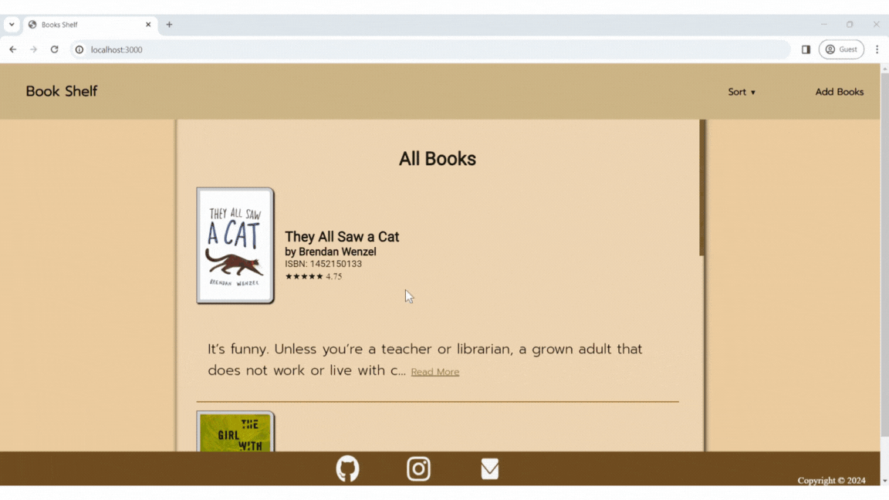
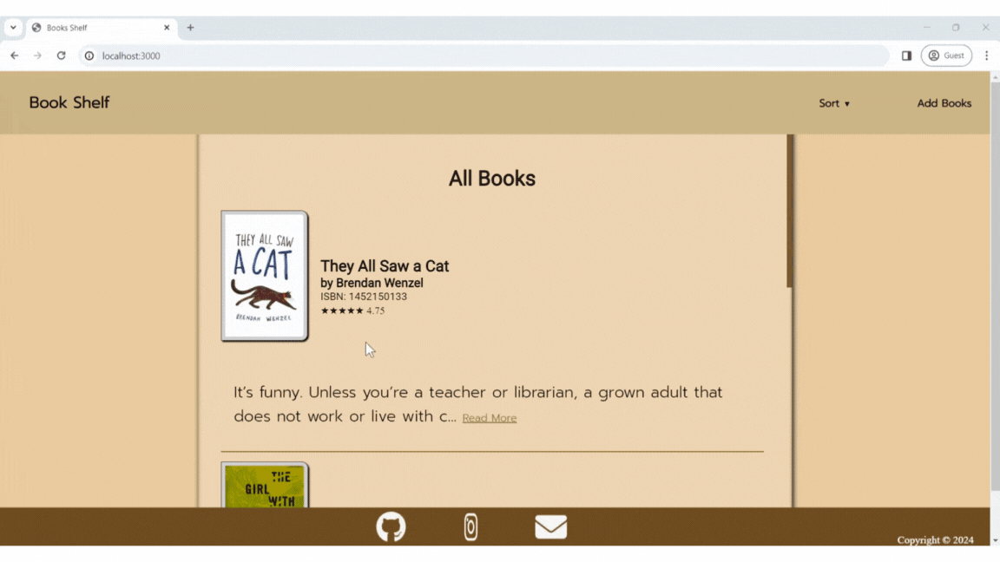
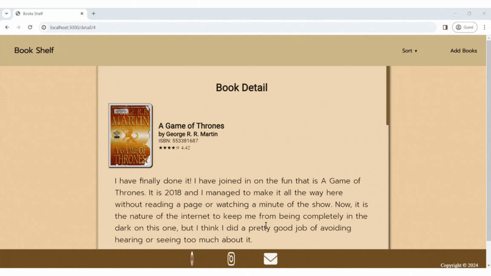
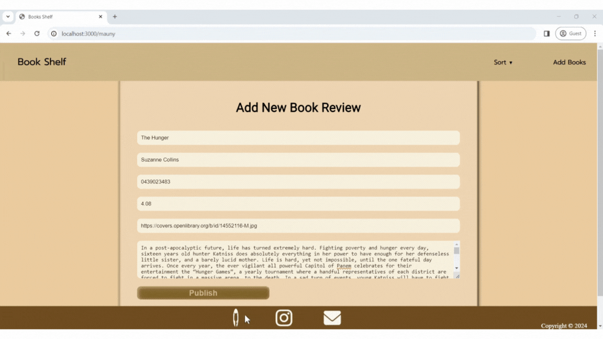

# Books Reviewer App
## About the website
This website was created to study how to use JavaScript with PostgreSQL. The website will pull data stored in PostgreSQL and display it.

## How to use and what you need
* The index.js file uses three main libraries:
    * **Express**: This library is used to start the server.
    * **BodyParser**: This library is used to store data entered by the user.
    * **pg**: This library allows you to use PostgreSQL in JavaScript.

* To use the website, you will need the following:
    * **Node.js**
    * **Node Package Manager (NPM)**
    * **PostgreSQL**

## Basic usage
1. After installing `Node.js`, open a terminal and install NPM with the command `npm i`.
2. Connect `JavaScript` to `PostgreSQL`. You can find the required information in the `.env.example` file.
3. Start the server with the command `node index.js`. If the server starts successfully, you will see the message "**Server running on port 3000**".
4. After starting the server, access the website at the URL: `http://localhost:3000/`.
5. To stop the server, press **`Ctrl+C`**.

## Introduction to the website
This website was created to allow users to read reviews of books, view the author's name and rating of the book, and add or delete reviews of books.

## Website details
Homepage: This is the first page that users will see. It displays a brief overview of the books, sorted by ID in PostgreSQL.

Recent: This page displays a brief overview of the books, sorted by the most recent ID in PostgreSQL.

Rating: This page displays a brief overview of the books, sorted by the highest rating in PostgreSQL.

Detail: This page displays all the data stored in PostgreSQL, including the full review.

Detail: This page also displays all the data stored in PostgreSQL, including the full review.

Back to homepage: To return to the homepage, simply click on the book cover.

Add book: To add a book review, click on "Add books". This will open a form where users can enter the details of the book they want to review.

After adding book: The book that the user added will be at the bottom of the list, and the data entered by the user will also be stored in PostgreSQL.

### Postscript
I would like to thank OpenLibrary for providing the book covers for this website. This is my first time writing a website using PostgreSQL and JavaScript. If you find any errors, please let me know and I will fix them in my next project. Finally, I have backed up the database in my project to the SQL directory. To use this website, you will need to import the database into PostgreSQL. Thank you for your feedback.
